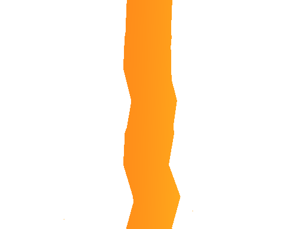

# Noise Displacement

A vertex displacement shader that uses noise to produce some funky results. 

It uses a surface shader instead of a frag shader, so it supports regular shading.

Has a smoothing part that samples the noise multiple times and normalizes it.

Made for a customer that accepted free redistribution. Enjoy!

# Usage

The shader works best with meshes smoothed normals, else the triangles behave weirdly.

You need to provide a noise texture (works best with a tileable one, even better if it's smooth). There are a couple provided in the repository.

# Examples

I had a pretty purple ball, but GIF compression screwed it over.

# Consider buying me a coffee if you like my work (click the image)

